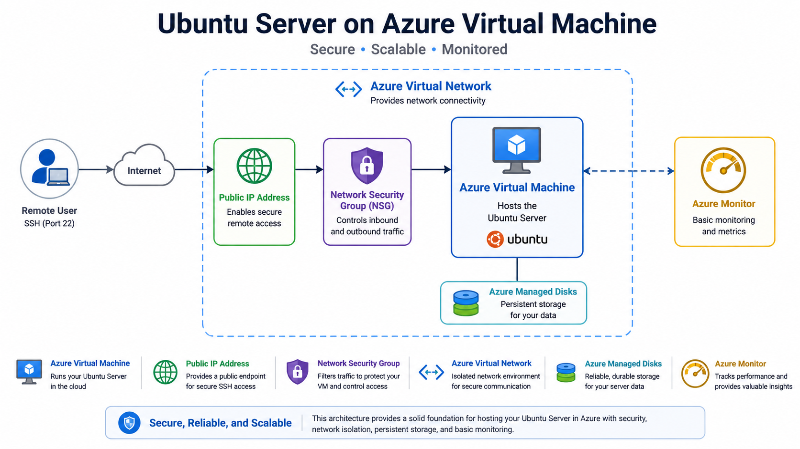
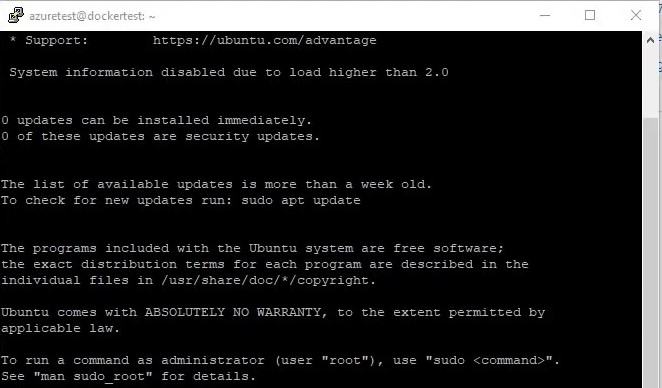

# Case Study 001

# Deploying a Secure Linux Web Server on Microsoft Azure

## Executive Summary

A company requires a secure and reliable Linux web server to host an internal business application.

The company currently operates without a centralized hosting platform and wants to migrate to Microsoft Azure to improve reliability, security, and scalability while keeping operational costs low.

This case study demonstrates how an Ubuntu Server virtual machine can be deployed on Microsoft Azure and secured using Azure networking, Network Security Groups (NSGs), UFW firewall, Docker, and Nginx. The solution follows Azure security best practices and provides a solid foundation for future growth.

## Business Scenario

Contoso Ltd. is a consulting company with approximately 40 employees. The company plans to migrate its internal web application to Microsoft Azure to improve security, scalability, and operational efficiency.

Current challenges include:

- Aging on-premises infrastructure
- No centralized backup strategy
- Limited scalability
- Manual server maintenance
- Security concerns

The objective is to deploy a secure Linux web server that can host the application while remaining easy to maintain and cost-effective.

## Business Requirements

The solution must satisfy the following requirements:

- Host a Linux-based web server
- Use Microsoft Azure as the hosting platform
- Provide secure remote administration using SSH
- Restrict unnecessary inbound traffic
- Support Docker containers
- Be easy to maintain
- Allow future scalability
- Keep monthly operational costs low

## Why was Ubuntu Server selected?

Ubuntu Server LTS was chosen due to its stability, long-term support, low licensing cost, and excellent compatibility with Docker and cloud environments.

## Why was Docker selected?

Docker was selected to simplify application deployment by packaging the application and its dependencies into containers, ensuring consistent deployments across environments.

## Why was a Virtual Network (VNet) created?

An Azure Virtual Network provides secure communication between Azure resources and allows the infrastructure to be segmented and expanded as business requirements evolve.

## Azure Services Used

| Service | Purpose |
|---------|---------|
| Azure Virtual Machine | Hosts the Ubuntu Server |
| Azure Virtual Network | Provides network connectivity |
| Network Security Group (NSG) | Controls inbound and outbound traffic |
| Public IP Address | Allows secure remote access |
| Azure Monitor | Basic monitoring and metrics |
| Azure Managed Disks | Persistent storage |

## Solution Architecture

## Deployment Steps

### Step 1
Create a Resource Group.

### Step 2
Deploy an Ubuntu Server 24.04 LTS virtual machine.

### Step 3
Create a Virtual Network and Subnet.

### Step 4
Associate a Network Security Group.

### Step 5
Allow inbound SSH (22).

### Step 6
Install Docker.

### Step 7
Deploy an Nginx container.

### Step 8
Verify web access.

## Security Implementation

The following security measures were implemented:

- Restricted inbound traffic using Network Security Groups (NSGs)
- Allowed only required ports (22, 80, and 443)
- Configured UFW on the Linux server
- Disabled unnecessary services
- Enabled automatic security updates
- Used SSH key authentication instead of passwords
- Applied the principle of least privilege

## Validation & Testing

The deployment was validated by confirming:

- The virtual machine was running successfully.
- SSH access was available.
- Docker service started automatically.
- The Nginx container responded to HTTP requests.
- Network Security Group rules functioned as expected.

## Cost Considerations

The solution was designed to minimize operational costs by:

- Using a small VM size suitable for development and testing
- Avoiding unnecessary Azure services
- Selecting cost-effective storage options
- Scaling resources only when required
