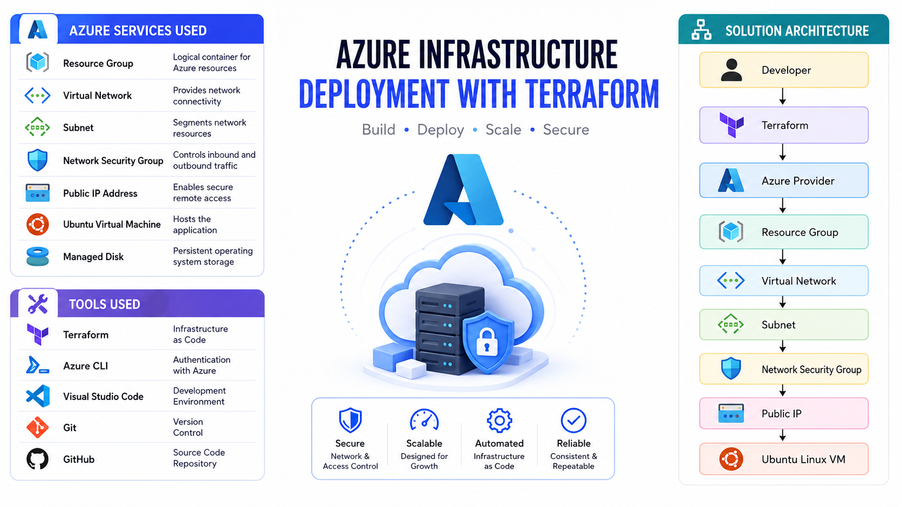

# Case Study 002

# Automating Azure Infrastructure Deployment Using Terraform

> **Scenario:** Standardizing Azure infrastructure deployment using Infrastructure as Code (IaC) to improve consistency, reduce manual effort, and accelerate provisioning.

---

# Executive Summary

Contoso Ltd. is experiencing rapid business growth and frequently deploys new Azure environments for development, testing, and production. The IT team currently provisions infrastructure manually through the Azure portal, resulting in inconsistent configurations, longer deployment times, and configuration drift.

To address these challenges, the organization adopted **Terraform** as its Infrastructure as Code (IaC) solution. Terraform automates the deployment of Azure resources using reusable code, ensuring consistent infrastructure across all environments.

This case study demonstrates how Terraform was used to provision an Azure Resource Group, Virtual Network, Network Security Group, Public IP Address, and Ubuntu Linux Virtual Machine while following Azure best practices.

---

# Business Scenario

Contoso Ltd. develops internal business applications for multiple departments.

As the number of projects increased, the IT department faced several operational challenges:

- Manual Azure deployments consumed significant time.
- Infrastructure configurations varied between engineers.
- Reproducing environments for testing was difficult.
- Infrastructure changes were not tracked through version control.
- Deployment errors increased operational risk.

The company decided to automate Azure infrastructure deployments using Terraform.

---

# Business Requirements

The new deployment process must:

- Deploy Azure infrastructure automatically.
- Produce identical environments every time.
- Reduce manual deployment errors.
- Support version-controlled infrastructure.
- Improve deployment speed.
- Be reusable for future projects.
- Follow Azure security best practices.

---

# Solution Design Decisions


## Why was Terraform selected?

Terraform was selected because it enables Infrastructure as Code (IaC), allowing Azure resources to be defined in code rather than deployed manually. This improves consistency, repeatability, collaboration, and change tracking through Git.

---

## Why Infrastructure as Code?

Infrastructure as Code eliminates repetitive manual deployments, reduces human error, and enables automated infrastructure provisioning across multiple environments.

---

## Why Ubuntu Server?

Ubuntu Server LTS was selected because it is stable, lightweight, widely supported, and integrates well with Docker and cloud-native workloads.

---

# Azure Services Used

| Azure Service | Purpose |
|---------------|---------|
| Resource Group | Logical container for Azure resources |
| Virtual Network | Provides network connectivity |
| Subnet | Segments network resources |
| Network Security Group | Controls inbound and outbound traffic |
| Public IP Address | Enables secure remote access |
| Ubuntu Virtual Machine | Hosts the application |
| Managed Disk | Persistent operating system storage |

---

# Tools Used

| Tool | Purpose |
|------|---------|
| Terraform | Infrastructure as Code |
| Azure CLI | Authentication |
| Visual Studio Code | Development |
| Git | Version Control |
| GitHub | Source Code Repository |

---

# Solution Architecture


```

---

# Deployment Process

## Step 1

Authenticate to Azure.

```bash
az login
```

---

## Step 2

Initialize the Terraform working directory.

```bash
terraform init
```

---

## Step 3

Validate the Terraform configuration.

```bash
terraform validate
```

---

## Step 4

Review the deployment plan.

```bash
terraform plan
```

---

## Step 5

Deploy the Azure infrastructure.

```bash
terraform apply
```

---

## Step 6

Verify that all Azure resources have been provisioned successfully.

---

# Security Implementation

The following security controls were implemented:

- Infrastructure managed through version-controlled Terraform code.
- Network Security Groups restrict unnecessary inbound traffic.
- SSH key authentication used instead of passwords.
- Least privilege access applied where possible.
- Azure resources organized within a dedicated Resource Group.

---

# Validation & Testing

The deployment was validated by confirming:

- Terraform completed successfully.
- Resource Group was created.
- Virtual Network and Subnet were provisioned.
- Network Security Group rules were applied.
- Public IP Address was assigned.
- Ubuntu Virtual Machine was running.
- SSH connectivity was successful.

---

# Benefits Achieved

After implementing Terraform, Contoso Ltd. achieved:

- Faster infrastructure deployments.
- Standardized Azure environments.
- Reduced manual configuration errors.
- Improved collaboration through Git.
- Repeatable infrastructure deployments.
- Easier disaster recovery.

---

# Challenges Encountered

During implementation, several challenges were identified:

- Learning Terraform syntax and structure.
- Managing Terraform state files.
- Understanding Azure resource dependencies.
- Configuring provider authentication.

These challenges were resolved through proper documentation and testing.
