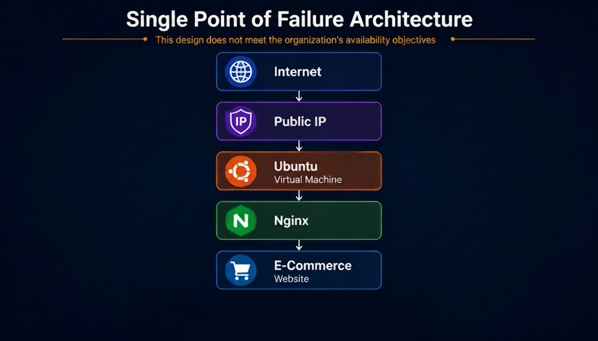

# Case Study 004

Designing a High Availability Architecture for a Business-Critical Web Application

## Executive Summary
Contoso Retail Ltd., a rapidly growing e-commerce company with approximately 250 employees, relies heavily on its online shopping platform to generate revenue and serve customers across multiple regions. The application is currently hosted on a single Azure Virtual Machine running Ubuntu Server and Nginx.

While the existing environment satisfies normal operational requirements, it introduces a significant business risk due to the absence of redundancy. Any planned maintenance, hardware failure, operating system issue, or unexpected outage would result in complete application downtime, directly affecting customer experience, company reputation, and revenue.

To address these challenges, a new highly available architecture was designed using Microsoft Azure. The proposed solution distributes application traffic across multiple Linux virtual machines deployed in separate Availability Zones using Azure Load Balancer. Health Probes continuously monitor server availability, allowing traffic to be automatically redirected to healthy instances in the event of a failure.

The redesigned architecture eliminates the single point of failure, improves service availability, enhances operational resilience, and establishes a scalable foundation capable of supporting future business growth.

## Business Services
Contoso Retail provides an online marketplace that allows customers to purchase consumer electronics, office equipment, and accessories. The company's primary revenue source depends on uninterrupted availability of its web platform.

During seasonal campaigns such as Black Friday, Cyber Monday, and holiday sales, website traffic can increase by more than 400%, requiring the underlying infrastructure to remain highly available and capable of handling sudden demand increases.

As the organization continues to expand, management has identified infrastructure resilience as a strategic business priority.

## Business Scenario
Contoso Retail's web application currently operates on a single Azure Virtual Machine.

Although this architecture has successfully supported daily operations, it presents several operational and business risks. The application depends entirely on one server, creating a single point of failure.
If the virtual machine experiences:

- Hardware failure
- Operating system corruption
- Planned maintenance
- Azure host maintenance
- Network issues
- Unexpected software crashes

the entire website becomes unavailable until the issue is resolved.

## Business Challenges
The current infrastructure presents several challenges that limit business continuity and operational efficiency.

### Single Point of Failure
The web application is hosted on a single virtual machine. Any failure immediately results in complete service interruption.

### Limited Scalability
As customer demand increases, scaling requires manual deployment of additional virtual machines, resulting in increased administrative effort and longer deployment times.

### Planned Maintenance Causes Downtime
Routine operating system updates, security patches, and application maintenance require the server to be restarted, temporarily interrupting customer access.

### Increased Operational Risk
Infrastructure failures have a direct financial impact due to lost transactions and decreased customer confidence.

### Lack of Automatic Failover
If the server becomes unavailable, no secondary server automatically assumes responsibility for processing incoming traffic.

## Business Impact
Potential consequences include:

Lost online sales
Reduced customer satisfaction
Increased support requests
Negative brand reputation
Financial losses during peak business periods

## Business Requirements
To address the identified challenges, the organization established the following technical and business requirements.

### Availability
The application must maintain high availability and eliminate single points of failure.

### Fault Tolerance
The infrastructure must continue serving customer requests even if one virtual machine becomes unavailable.

### Load Distribution
Incoming client requests must be distributed evenly across multiple web servers.

### Health Monitoring
The solution must automatically detect unhealthy servers and stop routing traffic to them.

### Scalability
The architecture should support future expansion without requiring major redesign.

### Security
Only HTTP and HTTPS traffic should be publicly accessible,Administrative SSH access must be restricted to authorized administrators.

### Cost Efficiency
The solution should maximize availability while minimizing unnecessary infrastructure costs.

### Operational Simplicity
The infrastructure should remain easy to maintain, monitor, and extend as business requirements evolve.

---
## Existing Environment and Current Architecture
The existing production environment consists of a single Linux virtual machine hosted within Microsoft Azure

## Proposed Solution

The redesigned solution distributes incoming client traffic across two Ubuntu Linux virtual machines deployed in separate Azure Availability Zones.
Azure Load Balancer serves as the entry point for all incoming requests. It continuously evaluates the health of each backend server using Health Probes
If one virtual machine becomes unavailable, Azure automatically removes it from the backend pool and redirects traffic to the remaining healthy server without requiring manual intervention

The proposed architecture provides several business benefits:
- Eliminates the single point of failure.
- Improves application availability.
- Reduces planned maintenance downtime.
- Supports future scalability.
- Improves customer experience.
- Increases operational resilience.

The new design also establishes a strong foundation for future enhancements such as Virtual Machine Scale Sets, Azure Front Door, Application Gateway, and Web Application Firewall

## Solution Design Decisions

