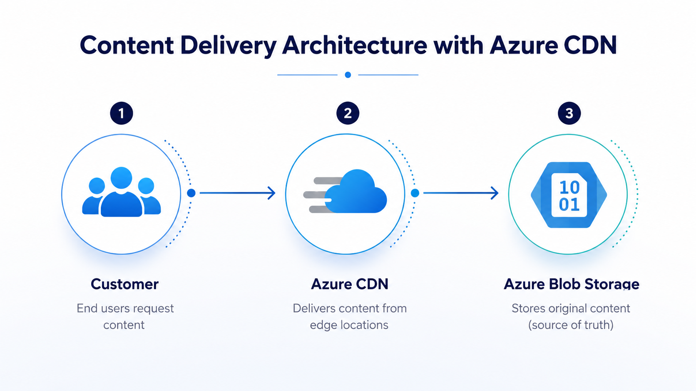
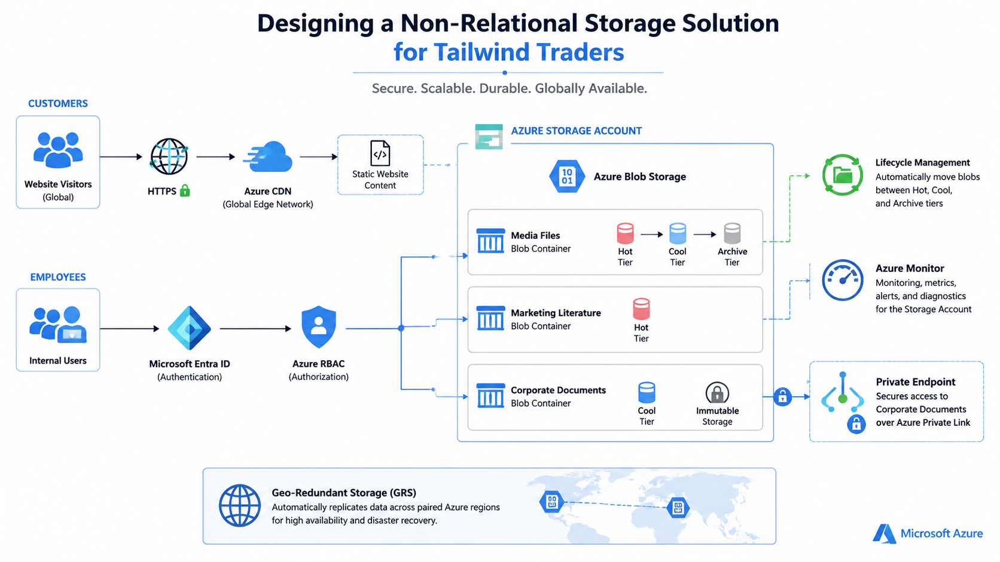

# Case Study 003

# Designing a Non-Relational Storage Solution for Tailwind Traders

## Executive Summary
Tailwind Traders is experiencing rapid growth in digital content, resulting in increasing storage costs, inconsistent performance, and growing operational complexity. The organization currently stores all files within an on-premises data center, including public media assets, marketing literature, and internal corporate documents.

As data volumes continue to increase, the existing infrastructure struggles to meet performance requirements while maintaining cost efficiency and regulatory compliance.

This case study proposes a cloud-native storage architecture using Microsoft Azure Storage services. The solution centralizes storage management, improves global accessibility, optimizes storage costs through lifecycle management, and secures sensitive corporate information while supporting long-term business growth.

**Business Objective**

Modernize the company's storage platform by migrating unstructured data to Microsoft Azure while reducing operational costs, improving scalability, and simplifying storage management.

---
# Business Scenario

Tailwind Traders manages a large volume of unstructured business data supporting both customer-facing and internal business operations.

The organization currently stores all files on traditional on-premises file servers.

As customer demand increases, the existing infrastructure has become increasingly difficult to scale and maintain. Public website traffic continues to grow, seasonal sales generate unpredictable spikes in demand, and compliance requirements require long-term retention of corporate documents.

# Business Challenges

The current storage environment presents several operational challenges

- Increasing storage costs due to duplicated content.
- Limited scalability of on-premises file servers.
- Website performance degradation during busy sales periods.
- Inefficient storage of infrequently accessed documents.
- Complex storage administration across multiple departments.
- Long-term compliance requirements for legal and financial documents.
- Lack of globally distributed storage for customer-facing content.

# Business Requirements

The new solution must satisfy the following requirements.

- Centralize storage management.
- Reduce infrastructure costs.
- Improve website performance.
- Support worldwide customer access.
- Provide highly durable storage.
- Protect sensitive corporate documents.
- Support regulatory retention requirements.
- Automatically optimize storage costs based on file usage.
- Scale without service interruption.

---

# Data Assessment

The organization stores three primary categories of unstructured data.

## Media Files

Examples include:

- Product images
- Promotional videos

Characteristics

- Publicly accessible
- High download frequency
- Large file sizes
- Read-only after publication
- Heavy seasonal traffic

Recommended Azure Service

**Azure Blob Storage**

Blob Storage is specifically designed to store large volumes of unstructured data while providing virtually unlimited scalability and high durability.

---

## Marketing Literature

Examples include:

- Product brochures
- Customer success stories
- Product guides
- Sustainability reports

Characteristics

- Uploaded by employees
- Downloaded by customers
- Shared publicly
- Document-based content

Recommended Azure Service

**Azure Blob Storage**

Blob Storage provides secure and cost-effective storage for documents while supporting direct downloads through web applications.

---

## Corporate Documents

Examples include:

- HR documents
- Finance records
- Legal contracts

Characteristics

- Sensitive information
- Internal access only
- Long-term retention
- Rarely accessed after one year
- Compliance requirements

Recommended Azure Service

**Azure Blob Storage with Immutable Storage enabled**

Although these documents are managed through an internal application, Blob Storage provides secure API-based access while Immutable Storage ensures records cannot be modified or deleted during the required retention period.

---

# Storage Architecture

| Data Type | Azure Service | Access Tier | Security |
|------------|--------------|-------------|----------|
| Media Files | Azure Blob Storage | Hot | HTTPS |
| Seasonal Media | Azure Blob Storage | Cool | HTTPS |
| Archived Media | Azure Blob Storage | Archive | HTTPS |
| Marketing Literature | Azure Blob Storage | Hot | Microsoft Entra ID |
| Corporate Documents | Azure Blob Storage | Cool + Immutable | Microsoft Entra ID + RBAC + Private Endpoint |

---

# Why Azure Blob Storage?

Azure Blob Storage was selected because it provides:

- Virtually unlimited scalability.
- High durability.
- Low operational overhead.
- Global accessibility.
- Native lifecycle management.
- Multiple storage tiers.
- Integration with Microsoft Entra ID.
- Built-in encryption.

Blob Storage is Microsoft's recommended service for storing unstructured data such as images, videos, documents, backups, and application files.

---

# Storage Tier Strategy

Different datasets exhibit different access patterns.

To optimize storage costs, Azure Blob Storage Access Tiers will be used.

| Tier | Usage |
|-------|-------|
| Hot | Frequently accessed media files and active marketing documents |
| Cool | Seasonal products and infrequently accessed documents |
| Archive | Historical campaigns and legacy content retained for business purposes |

Lifecycle Management policies automatically transition data between tiers based on access frequency.

Example policy:

- Move objects to the **Cool** tier after 30 days.
- Move objects to the **Archive** tier after 180 days.

This automation significantly reduces long-term storage costs without manual intervention.

---

# Immutable Storage Strategy

Corporate HR, Finance, and Legal documents require protection against accidental or malicious modification.

Azure Immutable Blob Storage will be enabled to satisfy these compliance requirements.

Benefits include:

- Prevents file deletion during the retention period.
- Supports legal hold scenarios.
- Helps satisfy regulatory compliance.
- Protects business-critical records.

Immutable Storage will only be applied to corporate documents, as media and marketing files do not require regulatory retention.

---
# Security Design

The proposed architecture follows Azure security best practices.

## Media Files

- HTTPS only
- Read-only access
- Azure CDN integration

## Marketing Literature

- Microsoft Entra ID authentication for employees
- Secure customer downloads
- HTTPS encryption

## Corporate Documents

- Microsoft Entra ID authentication
- Azure RBAC
- Private Endpoint
- Public access disabled
- Encryption at rest
- Immutable Storage

---

# Performance Optimization

This architecture reduces latency, improves download performance, and offloads traffic from the primary application servers.

---

# Cost Optimization

The solution reduces storage costs by implementing:

- Azure Blob Storage
- Lifecycle Management
- Cool Storage Tier
- Archive Storage Tier
- Automatic tier transitions
- Elimination of duplicate content

These improvements ensure that storage costs align with actual data access patterns.

---

# Azure Well-Architected Framework

The proposed solution aligns with Microsoft's Azure Well-Architected Framework.

### Cost Optimization

Lifecycle Management and Blob Access Tiers minimize storage expenses.

### Performance Efficiency

Azure CDN delivers media content with low latency to customers worldwide.

### Reliability

Geo-redundant storage protects business data against regional failures.

### Security

Microsoft Entra ID, RBAC, Private Endpoints, HTTPS, and Immutable Storage secure sensitive information.

### Operational Excellence

Centralized cloud storage simplifies administration, monitoring, and future expansion.

---

## Proposed Azure Storage Solution Architecture

### The proposed architecture delivers the following business outcomes.

- Centralized cloud-based storage.
- Reduced operational costs.
- Improved website performance.
- Secure storage for sensitive business documents.
- Automatic storage optimization.
- Global content availability.
- Long-term compliance support.
- Simplified storage management.
