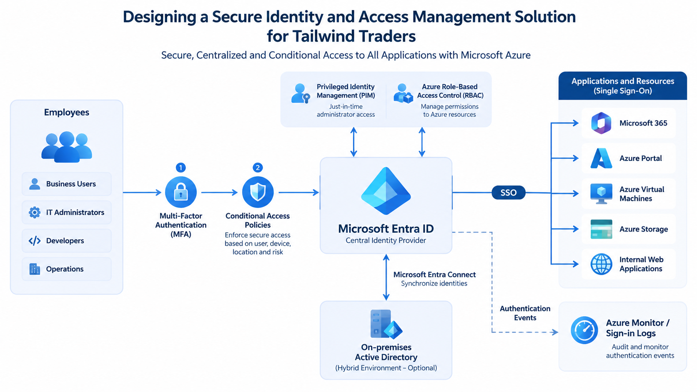

# Case Study 004
# Designing a Secure Identity and Access Management Solution 

## Executive Summary

This case study demonstrates how to design a secure identity platform for an enterprise organization migrating workloads to Microsoft Azure
The objective is to centralize identity management, strengthen authentication security, reduce administrative risk, and provide seamless access to cloud resources using Microsoft Entra ID
This solution follows Microsoft Cloud Adoption Framework recommendations and Zero Trust security principles.

---

## Business Scenario
The organization currently manages:

- Microsoft 365
- Azure Virtual Machines
- Azure Storage Accounts
- Internal Web Applications
- Azure Portal

Currently users authenticate separately to multiple systems

### The company requires:

- Centralized identity management
- Strong authentication
- Single Sign-On
- Secure administrator access
- Least Privilege permissions
- Monitoring of sign-in activity
- Hybrid identity support

## Business Requirements
The organization requested:

✅ Single Sign-On (SSO)
✅ Multi-Factor Authentication (MFA)
✅ Conditional Access
✅ Role-Based Access Control
✅ Privileged Identity Management
✅ Secure administration
✅ Audit logs
✅ Hybrid Active Directory integration

## Solution Architecture
The architecture consists of Microsoft Entra ID acting as the centralized identity provider

Hybrid identities are synchronized from On-Premises Active Directory using Microsoft Entra Connect.

Administrators use Privileged Identity Management to elevate permissions only when required

---

## Azure Services Used

|             Service            |             Purpose             |
|:------------------------------:|:-------------------------------:|
| Microsoft Entra ID             | Identity Provider               |
| Microsoft Entra Connect        | Hybrid Identity Synchronization |
| Conditional Access             | Access Policies                 |
| Multi-Factor Authentication    | Strong Authentication           |
| Privileged Identity Management | Just-In-Time Administration     |
| Azure RBAC                     | Least Privilege Access          |
| Azure Monitor                  | Authentication Monitoring       |
| Sign-in Logs                   | Security Auditing               |
| Microsoft 365                  | SSO Application                 |
| Azure Storage                  | Cloud Resource                  |
| Azure Virtual Machines         | Infrastructure                  |
| Azure Portal                   | Cloud Management                |

